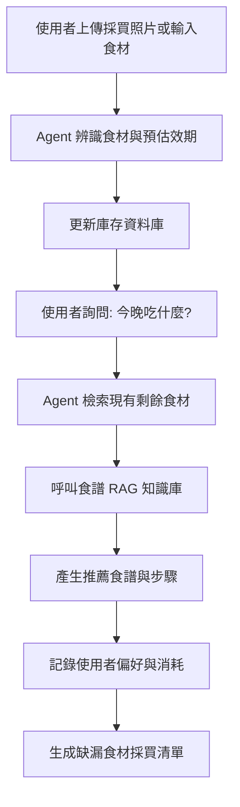
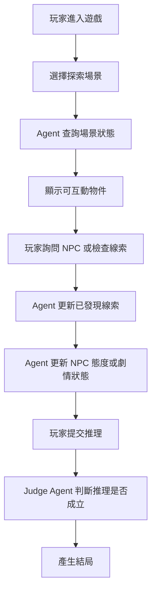

# 期末專題主題提案報告說明

# 1. 專題名稱與一句話說明


## 需要包含

* 專題名稱：AI 冰箱大管家 (AI Kitchen Chef Agent)  
* 系統類型：生活管理與食譜推薦 Agent 系統
* 目標任務：精準管理食材庫存、追蹤過期日，並根據剩餘食材與使用者健康目標進行自動化食譜規劃。
* 使用者可以得到什麼成果：使用者能減少食材浪費、自動產生採買清單，並獲得量身打造的烹飪建議。  較佳範例一句話說明AI 冰箱大管家協助使用者追蹤食材效期、管理庫存，並根據現有材料與健康偏好推薦食譜的智慧廚房助手。

## 範例

| 專題名稱              | 一句話說明                                                    |
| --------------------- | ------------------------------------------------------------- |
| AI 程式競賽教練 Agent | 協助學生分析解題錯誤、產生測資並給出分層提示的 AI 教練        |
| AI 推理解謎 Agent     | 讓玩家透過探索、對話與線索推理完成案件的互動式 Agent 系統     |
| AI 研究助理 Agent     | 協助使用者整理論文、比較研究方法並找出研究 gap 的研究輔助系統 |

## 不佳範例

```text
我們想做一個 AI 聊天機器人。
```

## 較佳範例

```text
我們想做一個能協助學生診斷程式錯誤、產生測資並推薦練習題的 AI 程式競賽教練。
```

---

# 2. 目標使用者與痛點

請說明這個系統是為誰設計，以及使用者目前遇到什麼問題。

## 需要包含

| 項目                | 說明                               |
| ------------------- | ---------------------------------- |
| 目標使用者          | 忙碌的上班族、外宿自炊學生、負責家庭採買者                   |
| 使用情境            | 下班回家看著冰箱，不知道能煮什麼。  在超市購物時，不確定家裡還有沒有某樣食材           |
| 痛點                | 食材常放到過期卻不自知，造成浪費。  搜尋食譜時，常發現缺漏關鍵食材。  手動輸入食材資料太過瑣碎，難以持續記帳             |
| 為什麼需要 AI Agent | 系統需具備「決策能力」，能根據剩餘食材、有效期與使用者的健康歷史紀錄，主動判斷哪些食材需要優先處理，而非只是被動的資料顯示 |

## 範例

```text
目標使用者：
準備程式競賽的新手學生。

使用情境：
學生練習題目時，程式無法通過測資，但不知道自己錯在哪裡。

痛點：
1. 不知道自己是題意理解錯、演算法錯，還是實作細節錯。
2. 直接看解答容易變成抄答案，缺少引導式學習。
3. 缺少根據個人弱點推薦練習題的機制。

為什麼需要 AI Agent：
因為系統需要根據學生的程式碼、錯誤測資與歷史紀錄，動態判斷下一步要給提示、產生測資，還是推薦新題目。
```

---

# 3. 核心任務流程

請說明使用者從開始使用到完成任務的完整流程。

這一部分是主題提案中最重要的內容之一。
學生要說清楚 Agent 如何一步一步完成任務，而不是只說「AI 會回答問題」。

## 需要回答的問題

| 問題                   | 說明                                           |
| ---------------------- | ---------------------------------------------- |
| 使用者輸入什麼？       | 文字、文件、程式碼、圖片、表單、語音等         |
| Agent 先判斷什麼？     | 意圖、任務類型、使用者狀態、資料需求等         |
| Agent 會查詢什麼資料？ | 文件、資料庫、API、題庫、知識庫等              |
| Agent 會呼叫哪些工具？ | 搜尋、計算、分析、產圖、執行程式、產生報告等   |
| Agent 如何更新狀態？   | 記錄使用者偏好、任務進度、遊戲狀態、學習弱點等 |
| 最後輸出什麼？         | 報告、建議、分析結果、提示、圖表、任務更新等   |

## 流程圖範例：AI 程式競賽教練 Agent



## 流程圖範例：AI 推理解謎 Agent



---

# 4. Agent 架構設計

請說明你們的系統中有哪些 Agent、模組或功能元件。

系統不一定要真的做成多 Agent，但至少要能看出不同任務的分工。

## 可使用的架構表格

| 模組 / Agent   | 任務           | 輸入       | 輸出       |
| -------------- | -------------- | ---------- | ---------- |
| Intent Agent   | 判斷使用者意圖 | 使用者訊息 | 任務類型   |
| RAG Agent      | 查詢知識庫     | 問題、文件 | 相關資料   |
| Tool Agent     | 執行工具       | 任務指令   | 工具結果   |
| Memory Agent   | 更新記憶       | 使用紀錄   | 使用者狀態 |
| Critic Agent   | 檢查回答品質   | 初稿回答   | 修正建議   |
| Response Agent | 整合回覆       | 所有結果   | 最終回答   |


| Agent                   | 任務                       |
| ----------------------- | -------------------------- |
| Inventory Agent      | 管理食材入庫與出庫，追蹤每一項食材的剩餘量   |
| Expiry Agent   | 專門判斷不同類型的食材（如葉菜類 vs. 根莖類）的預估保存期限  |
| Chef Agent (RAG) | 根據現有食材庫存，從知識庫中匹配最適合的食譜  |
|  Memory Agent     | 記錄使用者過敏原（如：不吃海鮮）與歷史點擊偏好 |
| Shopping Agent | 判斷庫存低於臨界值或食譜缺件時，自動整理採買清單 |


---

# 5. RAG / 資料來源設計

請說明 Agent 的回答或判斷會依據哪些資料，而不是完全憑空生成。

## 需要包含

| 項目         | 說明                                       |
| ------------ | ------------------------------------------ |
| 食材保存期限表 (CSV)     | 建立各類食物的平均保鮮期對照表  |
|  食譜知識庫 (Markdown/JSON)     | 儲存數百道料理的食材需求、烹飪步驟與營養成分  |
|  使用者偏好文件 | 記錄使用者不喜歡的食材或特定飲食習慣（如：生酮、純素）。  查詢方式：當使用者詢問建議時，Agent 會進行語意檢索，找出最符合現有食材庫存的料理     |


## 提案時需說明

```text
我們會建立哪些資料？
資料格式是什麼？
Agent 什麼時候會查資料？
查到資料後如何整合進回答？
如何避免 Agent 憑空生成？
```

---

# 6. Tool Calling 設計

每組至少要規劃 3 個工具。
工具可以是自己寫的 function，也可以是外部 API、資料庫查詢、檔案處理、計算工具或分析工具。

## 工具類型範例

| 工具類型 | 範例                              |
| -------- | --------------------------------- |
| 查詢工具 | 查資料庫、查文件、查 API          |
| 分析工具 | pandas 分析、程式碼分析、文字分類 |
| 產生工具 | 產生 PDF、圖表、測資、報告        |
| 計算工具 | 預算估算、碳排估算、分數計算      |
| 狀態工具 | 更新任務狀態、玩家狀態、學習紀錄  |
| 評估工具 | 檢查答案、評分、風險判斷          |

## 提案時需準備工具表

| 工具名稱 | 功能 | 輸入 | 輸出 | 觸發時機 |
| -------- | ---- | ---- | ---- | -------- |
| Shelf_Life_Calc   | 計算預計到期日食材類別、購買日期到期日期、狀態食材入庫時     |      |      |          |
| Recipe_Matcher   |   篩選符合條件食譜現有食材、忌口清單食譜清單請求晚餐建議時   |      |      |          |
| List_Exporter   |  匯出採買清單缺少的食材項目Markdown 格式清單庫存不足或確認食譜    |      |      |          |

---

# 7. 預期畫面與操作方式

提案階段不需完成系統，但需要規劃使用者會如何操作。

至少需準備 3 個畫面草圖或 Wireframe。

## 建議畫面

| 畫面               | 內容                                |
| ------------------ | ----------------------------------- |
| 首頁 / 任務輸入頁  | 使用者輸入問題、文件、程式碼或任務  |
| Agent 工作頁       | 顯示 Agent 分析、工具呼叫、狀態更新 |
| 結果頁 / Dashboard | 顯示報告、圖表、建議、任務結果      |

## 範例：AI 程式競賽教練

| 畫面               | 內容                             |
| ------------------ | -------------------------------- |
| 題目與程式碼輸入頁 | 貼上題目、選擇語言、貼上程式碼   |
| 錯誤診斷頁         | 顯示錯誤類型、失敗測資、提示     |
| 學習 Dashboard     | 顯示常錯概念、練習紀錄、推薦題目 |

## 範例：AI 推理解謎 Agent

| 畫面       | 內容                       |
| ---------- | -------------------------- |
| 遊戲場景頁 | 顯示目前地點、可探索物件   |
| NPC 對話頁 | 與角色進行對話             |
| 線索板頁   | 顯示已發現線索與推理提交區 |

---

# 8. 期末 Demo 情境設計

提案階段就需要先規劃期末展示要如何進行。

## 需要回答

```text
使用者會輸入什麼？
Agent 會做哪些判斷？
Agent 會呼叫哪些工具？
中間狀態如何改變？
最後輸出什麼成果？
觀眾能看到什麼展示效果？
```

## 好的 Demo 情境範例

| 題目         | Demo 情境                                   |
| ------------ | ------------------------------------------- |
| 程式競賽教練 | 輸入錯誤程式，Agent 找出會錯的測資並給提示  |
| 研究助理     | 上傳 5 篇論文，Agent 產出文獻矩陣與 gap     |
| 假訊息查核   | 貼上社群謠言，Agent 抽 claim 並產生查核報告 |
| NPC 系統     | 玩家騙了商人，村長之後態度改變              |
| 推理解謎     | 玩家找線索、問 NPC，最後推理破案            |
| 履歷 Agent   | 上傳履歷與 JD，Agent 模擬面試並評分         |

## 不佳 Demo

```text
使用者問一個問題，AI 回答。
```

## 較佳 Demo

```text
使用者上傳資料或輸入任務，Agent 判斷任務類型，查詢資料，呼叫工具，更新狀態，最後產生具體成果。
```

---

# 9. 組員分工

請清楚說明每位組員負責的部分。

## 分工表範例

| 成員 | 負責內容                             |
| ---- | ------------------------------------ |
| A    | 前端 UI、頁面流程、使用者操作設計    |
| B    | 後端 API、資料庫設計、登入或紀錄功能 |
| C    | Agent 流程、Prompt、Tool Calling     |
| D    | RAG、文件處理、資料建置              |

## 注意事項

分工不能只寫：

```text
大家一起做。
```

需明確說明每位成員負責什麼功能或模組。

---

# 10. 評估方式

請說明期末時要如何判斷這個 Agent 是否做得好。

## 評估面向

| 評估面向       | 說明                             |
| -------------- | -------------------------------- |
| 任務完成率     |Agent 是否能準確從模糊輸入中識別食材並計算日期         |

| 記憶一致性     | Agent 是否能記住使用者「不吃辣」的設定，在食譜推薦中自動過濾掉麻婆豆腐。  展示效果：Demo 時能否流暢展示從「入庫」到「生成食譜」的完整閉環         |


